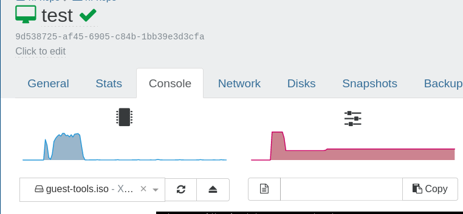

# xen orchestra


## cloud-init templates


### setup debian template

Follow the debian installer and if you want to use cloud init auto resize use filesytem only dont use lvm.

Install guest tools mount guest tool iso in the vm console.



```
Home --> VMs --> yourtempalte --> Console --> select disk add guest-tools.iso
```


Then on the vm mount sr0 ignore warnings.
```
mount /dev/sr0 /mnt/

```

Run the install script and reboot.
```
/mnt/Linux/install.sh 
```

Then install these pacakges for cloud-init image.

```
cloud-init
cloud-guest-utils
resolvconf
```

Also add extra cloud-init config got this from ubuntu server cloud images.
```
vim /etc/cloud/cloud.cfg.d/90_dpkg.cfg
```
Paste in this.
```
# to update this file, run dpkg-reconfigure cloud-init
datasource_list: [ NoCloud, ConfigDrive, OpenNebula, DigitalOcean, Azure, AltCloud, OVF, MAAS, GCE, OpenStack, CloudSigma, SmartOS, Bigstep, Scaleway, AliYun, Ec2, CloudStack, Hetzner, IBMCloud, Oracle, Exoscale, RbxCloud, UpCloud, VMware, Vultr, LXD, NWCS, Akamai, None ]
```

debian cloud init network config example.

```
#cloud-config
version: 1
config:
    - type: physical
      name: enX0
      subnets:
      - type: static
        address: '192.168.1.49'
        netmask: '255.255.255.0'
        gateway: '192.168.1.1'
        dns_nameservers:
          - 1.1.1.1
          - 8.8.8.8
        dns_search:
          - local.net
          - lol.local.net
```
debian cloud init config example.
```
#cloud-config
hostname: {name}.lol.local.net
user: debian
ssh_authorized_keys:
  - ssh-ed25519 yourpubkey
  - ssh-ed25519 yourpubkey2
manage_etc_hosts: {name}.lol.local.net
fqdn: {name}.lol.local.net
package_upgrade: true
users:
 - default
  # to encrypt password mkpasswd -m sha-512
 - passwd: hash
# resize root files system
# its best to setup server with filesystem not lvm when using this.
resize_rootfs: true
growpart:
  mode: auto
  devices: ['/']
  ignore_growroot_disabled: false
packages:
  - gnupg
  - bash-completion
  - curl
  - wget
  - python3
  - python3-pip
  - git
  - vim
  - lvm2
  - sudo
  - openssh-server
  - cloud-init
  - cloud-guest-utils
  - resolvconf
  - xe-guest-utilities
runcmd:
  - [sytemctl, enable, --now, xe-linux-distribution]

```


